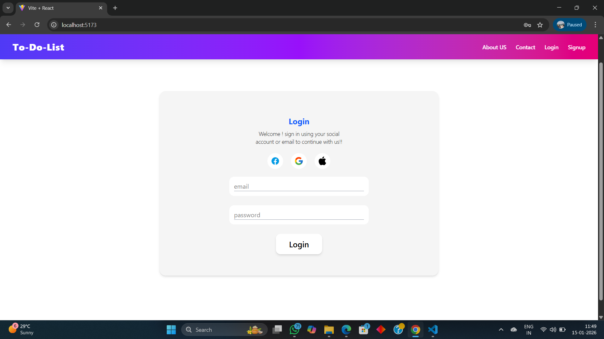
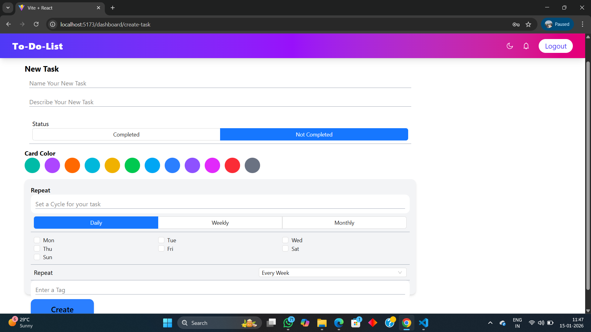
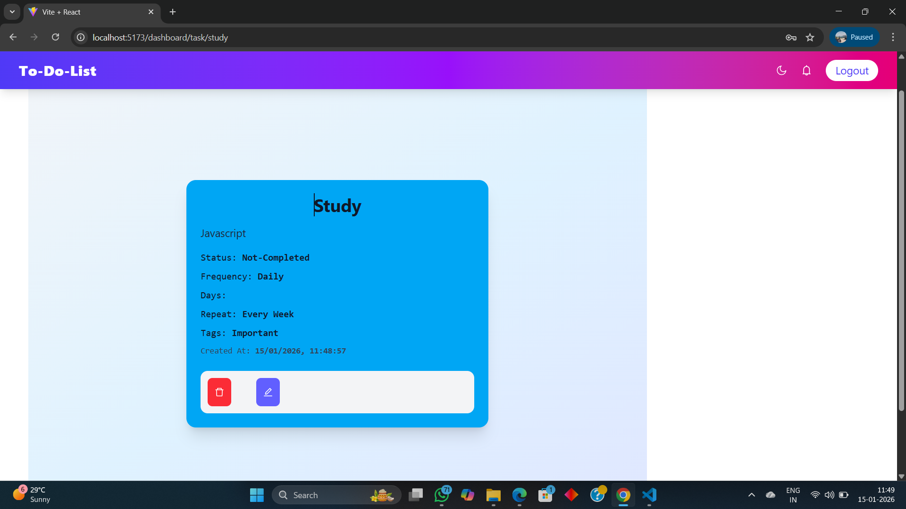

# Authentication & To-Do Application

A full-stack web application that allows users to register, log in, and manage their personal to-do lists. This project demonstrates user authentication, secure password handling, JWT-based protected routes, and CRUD operations for tasks.

## 🛠 Tech Stack

- **Frontend:** React.js, Tailwind CSS  
- **Backend:** Node.js, Express.js  
- **Database:** MongoDB  
- **Authentication:** JWT (JSON Web Tokens), bcrypt for password encryption  

## ⚙ Features

### Authentication
- User registration with email and password  
- Secure password encryption with bcrypt  
- User login with JWT authentication  
- Protected routes accessible only by authenticated users  

### To-Do Management (After Login)
- Display the user's to-do list with date & time  
- Create new to-dos  
- Update existing to-dos  
- Delete to-dos  
- Users can only access their own to-dos  
### Screenshots






## 🚀 Getting Started

### Backend Setup

1. Clone the repository:

```bash
git clone 
cd backend

Install dependencies:

npm install


Start the server:

npm run dev


Server will run at: http://localhost:4000

Frontend Setup

Navigate to frontend:

cd frontend


Install dependencies:

npm install


